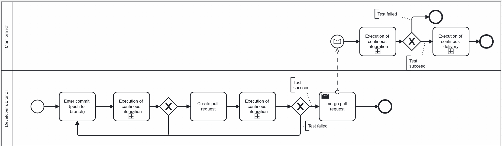
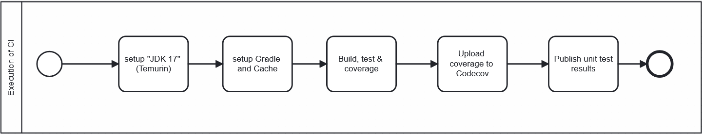
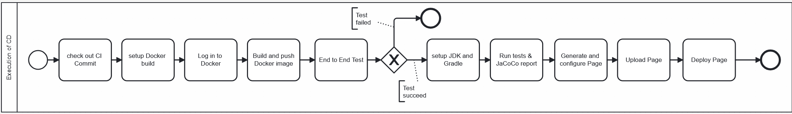

# CI/CD Pipeline check
>This folder contains all GitHub Actions workflows used for Continuous Integration and Continuous Delivery of our project.
The workflows build, test, analyze, and deploy the application automatically.

### Our CI/CD pipeline is split into two separate workflows:

1. CI (Build & Test)
    - Runs on every push and pull request.
    - Builds the project, executes unit tests and uploads test coverage.

2. CD (Docker & Pages)
    - Runs automatically after CI succeeds on the main branch.
    - Builds and pushes a Docker image.
    - Runs end-to-end tests inside Docker.
    - Builds documentation and deploys GitHub Pages.

## CI/CD Workflow

## Subtask - Execution of continous integration

## Subtask - Execution of continous delivery

*KPIs and metrics can be seen [here](../../README.md).*
